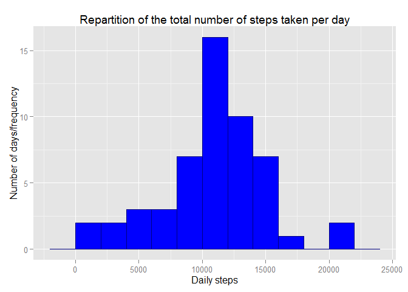
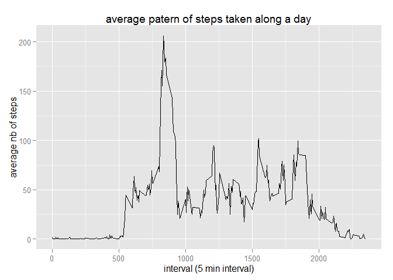
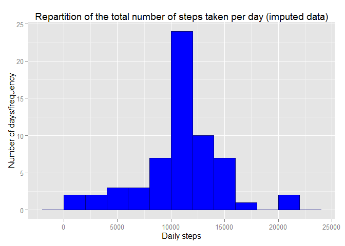
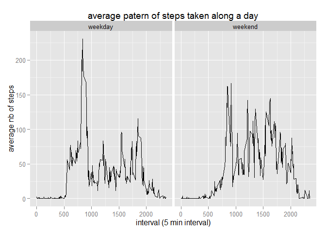

# Reproducible Research: Peer Assessment 1

## Loading and preprocessing the data


```r
setwd("C:/Users/Franck/Desktop/coursera/reproducibility")
DB<-read.csv("activity.csv",header=T)
DB$date<-as.Date(DB$date)
DB$interval<-ts(DB$interval)
time<-strptime(sprintf("%s %04d", DB$date, DB$interval),format="%F %H%M")
hour<-format(time, format = "%H:%M")
DB<-cbind(DB,time,hour)
db<-na.omit(DB)
hday<-hour[1:288]
```

##What is mean total number of steps taken per day?

- Summming the steps for each day in a new table


```r
by_day<-aggregate(steps~date,data=db,FUN=sum)
```

- then building the histogram of daily steps


```r
library(ggplot2)
histo<-ggplot(by_day,aes(steps))+
        geom_histogram(binwidth=2000,fill="blue",colour="navy")+
  	xlab("Daily steps")+
		ylab("Number of days/frequency")+
		ggtitle("Repartition of the total number of steps taken per day")
print(histo)
```

 

- calculation of daily steps mean  


```r
mean(by_day$steps)
```

```
## [1] 10766.19
```

- calculation of daily steps median  


```r
median(by_day$steps)
```

```
## [1] 10765
```


##What is the average daily activity pattern?

- first, creating a data summary of number of steps by interval


```r
by_interval<-aggregate(steps~interval,data=db,FUN=mean)
```

- then displaying it on a graph


```r
ts_plot<-ggplot(by_interval,aes(interval,steps))+geom_line()+xlab("interval (5 min interval)")+ylab("average nb of steps")+ggtitle("average patern of steps taken along a day")
print(ts_plot)
```

 

**Which 5-minute interval, on average across all the days in the dataset, contains the maximum number of steps?**


```r
hourmax<-hday[by_interval$steps==max(by_interval$steps)]
paste("maximum steps taken on interval of ", hourmax, " with an average of ", round(max(by_interval$steps),1), "steps")
```

```
## [1] "maximum steps taken on interval of  08:35  with an average of  206.2 steps"
```

##Imputing missing values

- total number of missing values in the dataset


```r
sum(is.na(DB$steps))
```

```
## [1] 2304
```

- new dataset will be in DB2, missing values will be replaced by the mean for the considered interval, calculated earlier  


```r
DB2<-DB
indexNA<-which(is.na(DB2$steps))
naDB<-DB[indexNA,]
for (i in 1:length(naDB$steps)) {
		naDB[i,]$steps<-by_interval[naDB[i,]$interval==by_interval$interval,]$steps		
		}
DB2[indexNA,"steps"]<-naDB$steps
```

- retaking the firsts steps, with an histogram of total of steps taken each day  
and calculation of the mean and median total number of steps taken per day


```r
by_day2<-aggregate(steps~date,data=DB2,FUN=sum)


histo2<-ggplot(by_day2,aes(steps))+
        geom_histogram(binwidth=2000,fill="blue",colour="navy")+
		xlab("Daily steps")+
		ylab("Number of days/frequency")+
		ggtitle("Repartition of the total number of steps taken per day (imputed data)")
print(histo2)
```

 


- mean of imputed data


```r
mean(by_day2$steps)
```

```
## [1] 10766.19
```

*For memory, mean of non imputed data was:*


```r
mean(by_day$steps)
```

```
## [1] 10766.19
```


- median of imputed data


```r
median(by_day2$steps)
```

```
## [1] 10766.19
```

*For memory, median of non imputed data was:*


```r
median(round(by_day$steps))
```

```
## [1] 10765
```

**So differences generated by imputation are negligible**


##Are there differences in activity patterns between weekdays and weekends?

- Creation of a factor to differentiate weekdays and weekend


```r
day<-weekdays(DB2$date)
WE<-(day=="samedi" | day=="dimanche")
```
*"samedi" is saturday and "dimanche" is sunday in french*


```r
we<-character(length=length(WE))
we[WE==TRUE]<-"weekend"
we[WE==FALSE]<-"weekday"
DB2<-cbind(DB2,we)
```

- and then, the graphic comparison of a weekday and a weekend day


```r
by_interval2<-aggregate(.~interval+we,data=DB2,FUN=mean)
ts_plot2<-ggplot(by_interval2,aes(interval,steps))+geom_line()+xlab("interval (5 min interval)")+ylab("average nb of steps")+ggtitle("average patern of steps taken along a day")+facet_grid(.~we)
print(ts_plot2)
```

 

**It appears that, if during the week end, the morning activity peak seen during the week around 8:30 is not present, there is a more important activity all day long.**
